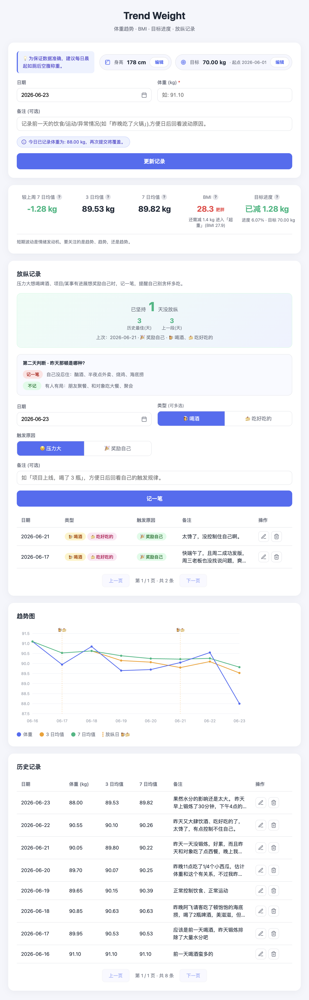

# 每日体重记录

- [每日体重记录](#每日体重记录)
  - [功能特性](#功能特性)
  - [目录结构](#目录结构)
  - [依赖说明](#依赖说明)
  - [快速开始](#快速开始)
  - [后台运行](#后台运行)
    - [如何判断服务是否真正在运行(LISTEN vs CLOSED)](#如何判断服务是否真正在运行listen-vs-closed)
  - [接口说明](#接口说明)
  - [测试](#测试)
  - [配置项 (.env)](#配置项-env)

一个用于记录每日体重并自动计算 **3 日 / 7 日移动平均** 的小工具。后端基于 FastAPI + SQLite, 前端为原生 HTML/CSS/JS, 包含录入表单、统计卡片、趋势图与历史记录表。

<p align="center">
  
</p>

> 生成的 weights.db 可以在IDE(例如Cursor)使用 SQLite Viewer 插件打开查看。

## 功能特性

- 录入每日体重(必填, 单位 kg)与备注(可选)。
- 日期在页面打开时自动取本地当天日期(`yyyy-mm-dd`), 也可手动修改。
- 同一天重复提交会覆盖更新(一天一条)。
- 自动计算移动平均: 默认 3 日与 7 日, 可在 `.env` 中通过 `MA_WINDOWS` 调整。前端会按接口返回的窗口**动态渲染**统计卡片、表格列与趋势曲线, 修改 `MA_WINDOWS` 无需改前端代码。
- 趋势图同时展示体重曲线与各窗口的移动平均曲线。
- 支持删除任意一天的记录。
- 个人档案(身高): 身高作为不随日期变化的全局信息单独存储, 页面顶部默认**只读展示**, 点"编辑"才可修改, 不会被每日录入误改。设置身高后, 统计卡片会自动以最新体重计算并展示 **BMI**。
- 放纵记录: 单独记录"喝酒/吃好吃的"这类放纵行为(**类型可多选**, 一次同时喝酒又吃也能记一条), 并标注**触发原因**(压力大 / 奖励自己)。约定**一天一条**(同日重复提交按日期覆盖, 选到已有记录的日期时按钮变"更新记录"并提示将覆盖), 与每日体重解耦; 列表支持**内联编辑**(修改类型 / 触发原因 / 备注)与删除, 备注过长时**悬浮显示完整内容**。页面突出展示 **「已坚持 N 天没放纵」** 横幅(当天破功则归零并标红提醒), 帮助靠"不要断签"的心理约束自己; 同时在趋势图上以**竖虚线 + 🍺/🍰 标记**标出放纵日, 直观对比"放纵之后体重曲线是否抬头"。

> 移动平均口径: 采用"最近 N 条记录"(即 N 个数据点)的均值。对每条记录取其自身及之前共 N 条记录求平均; 不足 N 条时用已有记录求平均。该口径对存在缺录的日期更稳健。

## 目录结构

```
weights/
├── app/
│   ├── config.py            # 环境配置加载
│   ├── database.py          # SQLite 连接(上下文管理器)与初始化
│   ├── models.py            # 请求体校验模型
│   ├── moving_average.py    # 移动平均计算
│   ├── crud.py              # 数据库增删改查
│   ├── request_context.py   # request_id 中间件/依赖项/全局异常处理
│   ├── profile_crud.py      # 个人档案(身高)数据库读写
│   ├── indulgence_crud.py   # 放纵记录数据库读写
│   ├── routers/
│   │   ├── records.py       # 体重记录接口
│   │   ├── profile.py       # 个人档案(身高)接口
│   │   └── indulgence.py    # 放纵记录接口
│   └── main.py              # FastAPI 应用入口
├── static/                  # 前端页面 (index.html / style.css / app.js)
├── tests/                   # pytest 单元/集成测试
├── requirements.txt         # 运行依赖
├── requirements-dev.txt     # 测试依赖
└── .env
```

## 依赖说明

项目把依赖拆成两个文件, 二者是**互补关系**(而非重复), 用于区分"生产运行需要的"和"只有开发/测试才需要的":

| 文件                   | 用途       | 内容                                              | 安装场景         |
| ---------------------- | ---------- | ------------------------------------------------- | ---------------- |
| `requirements.txt`     | 运行依赖   | FastAPI、uvicorn、aiosqlite、loguru、python-dotenv | 生产、开发都需要 |
| `requirements-dev.txt` | 测试依赖   | pytest、httpx                                      | 仅开发/测试需要  |

这样拆分的好处:

- **生产部署更精简**: 线上只装 `requirements.txt`, 不会把 `pytest` 等测试工具带到生产环境, 减小体积与攻击面。
- **职责清晰**: 一眼区分核心运行依赖与辅助开发工具。

安装方式:

```bash
# 生产环境: 只装运行依赖
pip install -r requirements.txt

# 开发环境: 运行依赖 + 测试依赖都要装
pip install -r requirements.txt
pip install -r requirements-dev.txt
```

> `requirements-dev.txt` 未通过 `-r requirements.txt` 引入运行依赖, 因此开发环境需分别安装两个文件。

## 快速开始

```bash
# 1. 创建并激活 conda 环境
conda create -n weights python=3.12 -y
conda activate weights

# 2. 安装依赖
pip install -r requirements.txt

# 3. 启动服务
python -m app.main
```

启动后访问 <http://127.0.0.1:8421> 即可使用。

## 后台运行

后台模式默认关闭热重载(`.env` 中 `RELOAD=false`), 保证单进程, 停止时不会残留孤儿进程。

```bash
# 启动: 输出重定向到日志文件
conda activate weights
nohup python -m app.main > logs/server.log 2>&1 &

# 查看实时日志
tail -f logs/server.log
```

查看服务是否在运行(端口取自 `.env` 的 `PORT`, 默认 8421):

```bash
lsof -i:8421          # 查看占用 8421 端口的进程
```

停止服务(按端口号, 精确结束监听该端口的进程):

```bash
lsof -ti:8421 | xargs kill
```

### 如何判断服务是否真正在运行(LISTEN vs CLOSED)

`lsof -i:<端口>` 的输出未必代表服务已启动, 需要看 `NAME` 列末尾的连接状态:

- **`(LISTEN)`**: 有进程正在**监听**该端口, 说明服务已启动。例如:

```
COMMAND   PID  ...  TYPE  ...  NODE NAME
python    xxx  ...  IPv4  ...  TCP 127.0.0.1:8421 (LISTEN)
```

- **`(CLOSED)`**: 只是**已关闭的客户端连接**残留(常见于浏览器之前访问过该端口), 并非服务在监听。例如:

```
COMMAND   PID            USER  ...  TYPE  ...  NODE NAME
Google  91875   peilongchencc  ...  IPv4  ...  TCP localhost:59682->localhost:8421 (CLOSED)
```

> 说明: 部分系统会把端口号显示为服务别名(如 8000 显示为 `irdmi`)。`->` 箭头表示该进程是作为**客户端**主动连出, 而非监听端口。这类 `CLOSED` 连接会被系统自动回收, 无需处理。

加 `-nP` 可禁用端口别名与主机名解析, 输出更直观; 也可只筛选监听状态来明确判断服务是否启动:

```bash
lsof -nP -i:8421                         # 不解析别名/主机名, 输出更清晰
lsof -nP -iTCP:8421 -sTCP:LISTEN         # 仅看监听状态, 无输出即服务未启动
```

## 接口说明

所有响应均为统一结构, 并包含用于日志追踪的 `request_id`。`request_id` 由中间件统一生成, 同时回填到响应头 `X-Request-ID`, 便于客户端与服务端日志对齐。即使发生未捕获异常, 也会返回统一结构(`code=500`)并携带同一 `request_id`。

| 方法   | 路径                  | 说明                       |
| ------ | --------------------- | -------------------------- |
| POST   | `/api/records`        | 新增/更新一天的体重记录    |
| GET    | `/api/records`        | 查询全部记录(含移动平均)   |
| DELETE | `/api/records/{date}` | 删除指定日期的记录         |
| GET    | `/api/profile`        | 查询个人档案(身高)         |
| PUT    | `/api/profile`        | 设置/更新身高(单位 cm)     |
| POST   | `/api/indulgences`    | 新增/更新一天的放纵记录(同日覆盖) |
| GET    | `/api/indulgences`    | 查询全部放纵记录(最新在前) |
| PUT    | `/api/indulgences/{id}` | 编辑放纵记录(类型/触发/备注) |
| DELETE | `/api/indulgences/{id}` | 删除指定 id 的放纵记录   |

> 身高存于单行 `profile` 表(`height_cm`, 取值范围 50-300 cm), 与每日体重记录解耦; 前端据此与最新体重计算 BMI。

> 放纵记录存于 `indulgences` 表, 每条含 `date` / `kind` / `trigger`(`stress` 压力 / `reward` 奖励) / `note`。其中 `kind` 支持**多选**, 取值为 `alcohol`(喝酒) / `food`(吃好吃的), 请求体用数组字段 `kinds`(如 `["alcohol","food"]`, 至少一项), 库内以逗号拼接存于 `kind` 列、读取时拆回数组。约定**一天一条**: `date` 列建唯一索引, 同日 `POST` 按日期 upsert 覆盖并复用原 `id`; `PUT /api/indulgences/{id}` 可编辑类型/触发/备注(日期不变)。「已坚持 N 天」由前端按最近一条记录日期计算, 后端只负责存取。

请求示例(POST `/api/indulgences`):

```json
{ "date": "2026-06-18", "kinds": ["alcohol", "food"], "trigger": "stress", "note": "项目延期，喝酒又点了外卖" }
```

请求示例(POST `/api/records`):

```json
{ "date": "2026-06-16", "weight": 91.1, "note": "晨起空腹" }
```

响应示例:

```json
{
  "code": 200,
  "message": "记录保存成功",
  "request_id": "b1e7...",
  "data": { "date": "2026-06-16", "weight": 91.1, "note": "晨起空腹" }
}
```

## 测试

```bash
conda activate weights
pip install -r requirements-dev.txt
python -m pytest -q
```

测试覆盖移动平均计算(纯函数)与体重记录、个人档案、放纵记录三组接口的增删改查、覆盖更新、参数校验及 `request_id` 一致性。

## 配置项 (.env)

| 变量         | 说明                         | 默认值          |
| ------------ | ---------------------------- | --------------- |
| `HOST`       | 监听地址                     | `127.0.0.1`     |
| `PORT`       | 监听端口                     | `8421`          |
| `DB_PATH`    | SQLite 文件路径              | `weights.db`    |
| `LOG_PATH`   | 日志文件路径                 | `logs/app.log`  |
| `MA_WINDOWS` | 移动平均窗口(逗号分隔, 天)   | `3,7`           |
| `RELOAD`     | 是否开启热重载(后台运行建议 `false`) | `false`   |